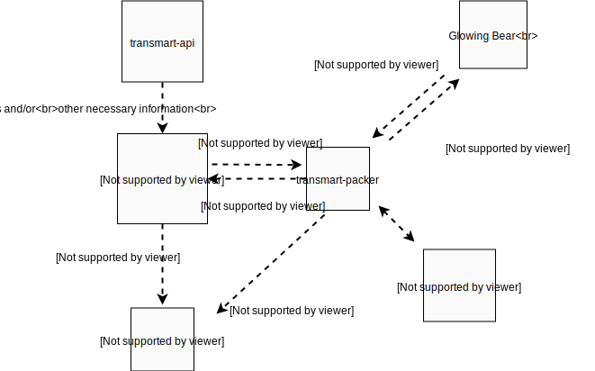

transmart-packer
================

|Build status| |codecov| |pypi| |downloads|

.. |Build status| image:: https://travis-ci.org/thehyve/transmart-packer.svg?branch=master
   :alt: Build status
   :target: https://travis-ci.org/thehyve/transmart-packer/branches
.. |codecov| image:: https://codecov.io/gh/thehyve/transmart-packer/branch/master/graph/badge.svg
   :alt: codecov
   :target: https://codecov.io/gh/thehyve/transmart-packer
.. |pypi| image:: https://img.shields.io/pypi/v/transmart-packer.svg
   :alt: PyPI
   :target: https://pypi.org/project/transmart-packer/
.. |downloads| image:: https://img.shields.io/pypi/dm/transmart-packer.svg
   :alt: PyPI - Downloads
   :target: https://pypi.org/project/transmart-packer/

Run data transformation jobs for TranSMART_.

.. _TranSMART: https://github.com/thehyve/transmart-core

Install
-------

First make virtual environment to install dependencies using `Python 3.6+`

.. code-block:: bash

    pip install transmart-packer

Or from source:

.. code-block:: bash

  git clone https://github.com/thehyve/transmart-packer.git
  cd transmart-packer
  pip install .

Dependencies
------------

* a Redis server running on localhost (or update ``packer/config.py``)

Running
-------

From root dir run:

.. code-block:: bash

  redis-server

  celery -A packer.tasks worker --loglevel=info

  transmart-packer

*Environment variables:*

==============================  =================
Variable                        Description
==============================  =================
``TRANSMART_URL``               The URL of the TranSMART API server
``KEYCLOAK_SERVER_URL``         Keycloak server URL, e.g., ``https://keycloak-dwh-test.thehyve.net``
``KEYCLOAK_REALM``              The Keycloak realm (default: ``transmart``)
``KEYCLOAK_CLIENT_ID``          The Keycloak client ID (default: ``transmart-client``)
``KEYCLOAK_OFFLINE_TOKEN``      The Keycloak offline token.
``REDIS_URL``                   Redis server URL (default: ``redis://localhost:6379``)
``DATA_DIR``                    Directory to write export data (default: ``/tmp/packer/``)
``LOG_CFG``                     Logging configuration (default: ``packer/logging.yaml``)
``CLIENT_ORIGIN_URL``           URLs to restrict cross-origin requests to (CORS) (default: ``*``)
==============================  =================

An optional variable `VERIFY_CERT` can be used to specify the path of a certificate collection file (`.pem`)
used to verify HTTP requests.

`KEYCLOAK_OFFLINE_TOKEN` should be generated for a user that has the following `realm-management` roles:

- ``offline_access`` - to be able to get the offline token.
- ``impersonation`` - to support running tranSMART queries on behalf of task users.

To get the token, run:

.. code-block:: bash

    curl \
      -d 'client_id=KEYCLOAK_CLIENT_ID' \
      -d 'username=OFFLINE_USERNAME' \
      -d 'password=OFFLINE_USERNAME_PASSWORD' \
      -d 'grant_type=password' \
      -d 'scope=offline_access' \
      'https://KEYCLOAK_SERVER_URL/auth/realms/KEYCLOAK_REALM/protocol/openid-connect/token'

The value of the `refresh_token` field in the response is the offline token.

To run the stack using ``docker-compose`` follow the commands below:

.. code-block:: bash

    # Downloads redis image and creates image with project dependencies.
    docker-compose build

    # After build is complete, start via:
    docker-compose up

On code change the webserver will automatically restart, but the Celery workers will not.
After updating the Celery task logic, you will need to restart the Docker container.

Usage
-----

Available handlers:

==============================  =================
Path                            Description
==============================  =================
``GET /jobs``                   List all known jobs for this user.
``POST /jobs/create``           Create a new job by providing `job_type` and `job_parameters`, creates the job and returns a `task_id`.
``GET /jobs/status/<task_id>``  Get status details for a specific task.
``GET /jobs/cancel/<task_id>``  Cancel scheduled or abort a running task.
``GET /jobs/data/<task_id>``    Download the data that this task produced.
``WS /jobs/subscribe``          Open websocket connection to get live updates on job progress.
==============================  =================

To start the toy job "add" on the localhost machine
make call to ``http://localhost:8999/jobs/create?job_type=add&job_parameters={%22x%22:500,%22y%22:1501}``.

Development
-----------

Components
++++++++++

    Overview of the components of transmart-packer and the interaction with external components.

Testing
+++++++

To run the test suite, we have to start redis-server and celery workers with the commands above.
Then you can run:

.. code-block:: bash

    python setup.py test

Extending
+++++++++

New jobs can be added by adding a new Celery function to the jobs folder and adding
the function to the jobs registry. See the `packer/jobs/example.py`_ to learn how.

.. _packer/jobs/example.py: https://github.com/thehyve/transmart-packer/blob/master/packer/jobs/example.py

Existing jobs
-------------

Basic export job
++++++++++++++++

Export transmart api client observation dataframe to tsv file

.. code-block:: json

    {
        "job_type":"basic_export",
        "job_parameters": {
            "constraint": {
                "type":"study_name",
                "studyId":"CSR"

            },
            "custom_name":"name of the export"
        }
    }

CSR export
++++++++++

`The Central Subject Registry (CSR) data model`_ specific export.
The model contains individual, diagnosis, biosource, biomaterial and study entities,
following the hierarchy for sample data: patient > diagnosis > biosource > biomaterial.
Studies are orthogonal to samples, i.e., patients are linked to studies independent of samples.
The entities IDs are first 5 columns of the export file. The rest of the columns are concepts.
Higher level concepts (e.g., Age that is specific to Patient level)
get distributed to all rows specific to lower levels (e.g. Diagnosis)

See the CSR_ test study as an example.

.. _CSR: https://github.com/thehyve/transmart-core/tree/dev/transmart-data/test_studies/CSR
.. _The Central Subject Registry (CSR) data model: https://github.com/thehyve/python_csr2transmart/blob/master/csr/csr.py

.. code-block:: json

    {
        "job_type":"csr_export",
        "job_parameters": {
            "constraint": {
                "type":"study_name",
                "studyId":"CSR"

            },
            "custom_name":"name of the export",
            "row_filter": {
                "type":"patient_set",
                "subjectIds": ["P2", "P6"]
            }
        }
    }

where:

- ``job_parameters.constraint`` - any `transmart v2 api constraint`_
  or composition of them that used to get data from transmart.
- ``job_parameters.custom_name`` (optional) - name of the export job and the output ``tsv`` file.
- ``job_parameters.row_filter`` (optional) - any `transmart v2 api constraint`_
  or composition of them to fetch keys (``[[[[patient], diagnosis], biosource], biomaterial]``) that will make it to the end result.
  E.g., given the `CSR` study and query above only rows specific to `P2` and `P6` patients will end up to the result table such as `P2`, `D2`, `BS2`, `BM2`, ... row.
  Please note that keys do not have to be equal in length. A row gets also selected if only part of keys matches. e.g. `P1` vs `P1`, `D1`

.. _`transmart v2 api constraint`: https://github.com/thehyve/transmart-core/blob/dev/open-api/swagger.yaml

Adding new entity to CSR data model:
^^^^^^^^^^^^^^^^^^^^^^^^^^^^^^^^^^^^

When the CSR data model is extended with new sample related entities, the export transformation code
has to be changed as well in order to include a column with the ID of the new entity as one of the identifying columns.

In order to do this, `<packer/table_transformations/csr_transformations.py>`_ file has to be modified.
Required changes:

1) extend the ``ID_COLUMNS`` list (the order does matter),

2) modify the ``from_obs_df_to_csr_df(obs: DataFrame)`` function in order to properly rename columns.

3) modify the ``from_obs_json_to_export_csr_df(obs_json: Dict)`` function to drop the entity column for study data.

License
-------

Copyright © 2019 The Hyve B.V.

This program is free software: you can redistribute it and/or modify
it under the terms of the GNU Affero General Public License as
published by the Free Software Foundation, either version 3 of the
License, or (at your option) any later version.

This program is distributed in the hope that it will be useful,
but WITHOUT ANY WARRANTY; without even the implied warranty of
MERCHANTABILITY or FITNESS FOR A PARTICULAR PURPOSE. See the
GNU Affero General Public License for more details.

You should have received a copy of the `GNU Affero General Public License`_
along with this program. If not, see https://www.gnu.org/licenses/.

.. _`GNU Affero General Public License`: LICENSE
